# VSCode教程

 [全部settings参考](README.assets\settings.json) 

 [自定义主题颜色参考](README.assets\custom theme.json) 


## 环境设置

1. 左下角 管理 --> 设置

2. 搜索 goroot/gopath
3. 点击 在settings.json中编辑

```json
{
    "go.gopath": "D:\\go",
    "go.goroot": "C:\\Program Files\\Go"
}
```


## 环境准备-插件安装

[在Visual Studio Code中配置GO开发环境的详细教程](http://www.viiis.cn/news/show_115464.html)


### VSCode-Go插件

https://github.com/microsoft/vscode-go

https://marketplace.visualstudio.com/items?itemName=lukehoban.Go


### 下载并编译go语言调试工具

| **程序名**             | 安装命令                                                     | **程序用途**                                                 |
| ---------------------- | ------------------------------------------------------------ | ------------------------------------------------------------ |
| dlv.exe                | go install github.com/go-delve/delve/cmd/dlv@latest          | go 语言调试工具                                              |
| gocode.exe             | go install -v github.com/nsf/gocode@latest                   | go语言代码检查，自动补全<br/>不在维护，无法支持1.8版本以上自动补全 |
| gocode.exe             | go install -v github.com/mdempsky/gocode@latest              | go语言代码检查，自动补全<br/>选择其他fork版本，比如：mdempsky/gocode。<br/>1.18版本以上使用 |
| godef.exe              | go install -v github.com/rogpeppe/godef@latest               | go语言代码定义和引用的跳转                                   |
| golint.exe             | go install -v golang.org/x/lint/golint@latest<br/>或者<br/>go get -u -v github.com/golang/lint/golint | go语言代码规范检查                                           |
| go-outline.exe         | go install -v github.com/lukehoban/go-outline@latest         | 用于在Go源文件中提取JSON形式声明的简单工具<br/>File outline 文件大纲 |
| gopkgs.exe             | go install -v github.com/tpng/gopkgs@latest                  | 快速列出可用包的工具<br/>Add Imports 添加引用                |
| gorename.exe           | go install -v golang.org/x/tools/cmd/gorename@latest         | 在Go源代码中执行标识符的精确类型安全重命名                   |
| goreturns.exe          | go install -v sourcegraph.com/sqs/goreturns@latest           | 类似fmt和import的工具，使用零值填充Go返回语句以匹配func返回类型 |
| go-symbols.exe         | go install -v github.com/newhook/go-symbols@latest           | 从go源码树中提取JSON形式的包符号的工具<br/>Workspace symbol search 工作区符号搜索 |
| gotour.exe             | go install -v github.com/Go-zh/tour/gotour@latest（中文）<br/>go install -v golang.org/x/tour/gotour@latest（英文） | go语言指南网页版                                             |
| guru.exe               | go install -v golang.org/x/tools/cmd/guru@latest             | go语言源代码有关工具，如代码高亮等                           |
| go-find-references.exe | github.com/lukehoban/go-find-references                      | Find References 搜索参考引用                                 |
| fiximports.exe         | go install -v golang.org/x/tools/cmd/fiximports@latest       |                                                              |
| goimports.exe          | go install -v golang.org/x/tools/cmd/goimports@latest        |                                                              |
| godex.exe              | go install -v golang.org/x/tools/cmd/godex@latest            |                                                              |
| gopls.exe              | go install -v golang.org/x/tools/gopls@latest                |                                                              |


### gopls

[Go Module 教程第 2 部分：项目、依赖和 gopls](https://zhuanlan.zhihu.com/p/426677425)


## GoLang调试

[用vscode开发和调试golang超简单教程](https://blog.csdn.net/v6543210/article/details/84504460)

[How To Debug Go Code with Visual Studio Code](https://www.digitalocean.com/community/tutorials/debugging-go-code-with-visual-studio-code)


打开main.go，按F5开始调试，如果没有编译错误可以看到，变量显示，调用堆栈的显示还是非常清晰的，可以F10单步，F11进入函数，跟一般Visual Studio 一样了。

按F5调试 可能会弹出

 

最大的原因可能是因为，VS code当前打开的文档不是main.go ,就那个包含main函数的go文件。


### 方式一

**解决方法就是点击打开 main.go ,再按F5进行调试。**


### 方式二

**另一种解决方法**是修改launch.json。路径：项目目录/.vscode/launch.json。

把program那个变量的值改一下，改成 "program": "${workspaceFolder}", 意思是调试的时候，以当前打开的文件夹根目录作为工程目录进行调试。

```json
{
    // 使用 IntelliSense 了解相关属性。 
    // 悬停以查看现有属性的描述。
    // 欲了解更多信息，请访问: https://go.microsoft.com/fwlink/?linkid=830387
    "version": "0.2.0",
    "configurations": [
        {
            "name": "Launch",
            "type": "go",
            "request": "launch",
            "mode": "auto",
            "program": "${workspaceFolder}",
            "env": {},
            "args": []
        }
    ]

```


### 添加build flag/args

> go build的编译参数和执行参数args

```json
{
    "version": "0.2.0",
    "configurations": [
        {
            "name": "Launch Package",
            "type": "go",
            "request": "launch",
            "mode": "auto",
            "program": "${workspaceRoot}",
            // 执行参数
            "args": ["-config", " server.json"],
            // 编译参数
            "buildFlags": "-tags 'server'",
            // 环境变量
            "env": {},
            "cwd": "${workspaceRoot}"
        }
    ]
}
```


## 触发建议

提示settings.json/launch.json怎么修改

1. 将鼠标放在需要提示的地方
2. Ctrl+Shift+P
3. 搜索 Trigger Suggest
4. 回车，则自动填充
5. 根据用户的需要去修改实际的值


## 自定义主题

1. 左下角 管理 --> 设置

2. 搜索 主题/color
3. 找到Editor: Token Color Customizations
4. 点击 在settings.json中编辑
5. 修改一下属性

```json
{
    "editor.tokenColorCustomizations": {
        // 该项的配置即为自定义主题设置
    }
}
```

 [自定义主题参考](README.assets\custom theme.json) 

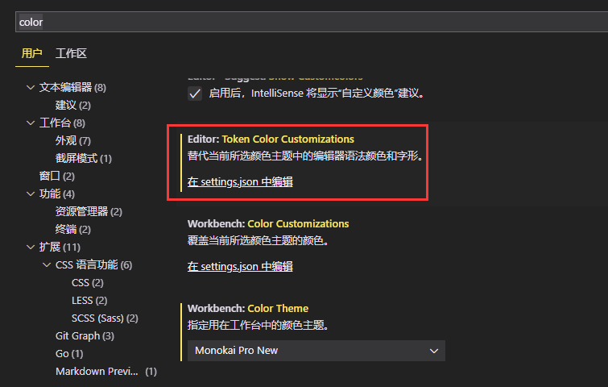


1. 光标选中需要查看的字段

   

2. Ctrl+Shift+P

3. 搜索inspect，选中如图所示

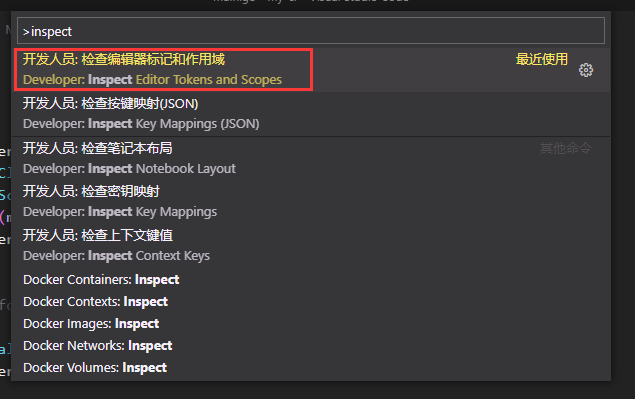

4. 显示信息

   

5. 复制textmate scopes

6. 再settings.json中的主题editor.tokenColorCustomizations的textMateRules去修改

   

7. Ctrl+Shift+P，搜索Trigger Suggest，会自动生成辅助代码

   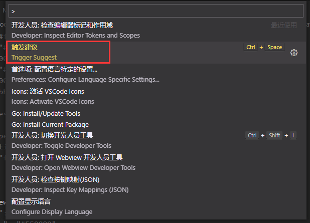

8. 修改辅助代码的scope和颜色，或者手动新增并修改scope和颜色

   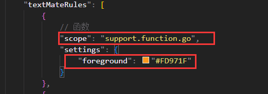

9. 查看生效效果

   

   


## 资源管理器树形结构

[vscode资源管理器中文件夹目录修改为树形结构](https://blog.csdn.net/wx1035589113/article/details/114265560)


**vocode资源管理器中显示的项目目录只有一个子目录是这样的**

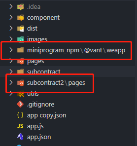

**这样不方便查看项目目录, 要修改为树形结构:**

1. 打开设置
   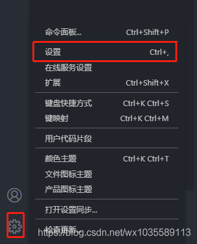
2. 找到用户->功能->资源管理器:
   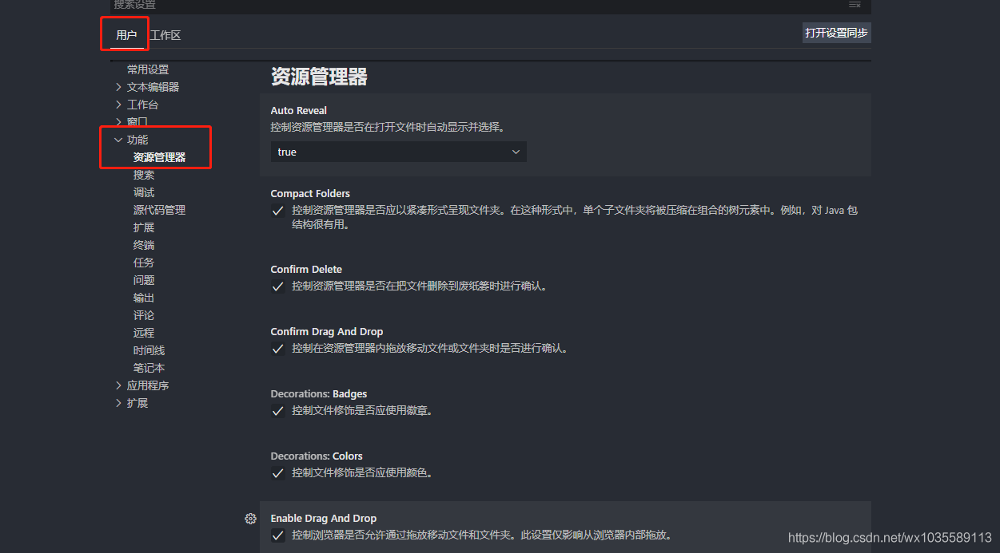
3. 将 `Compace Folders`取消勾线:
   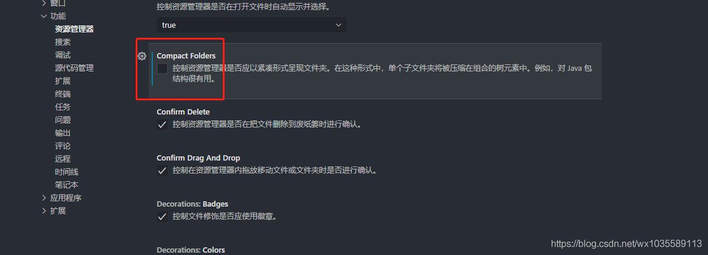

然后显示目录就是树形结构了:


## 资源管理器vscode文件树缩进

[vscode文件树缩进](https://www.cnblogs.com/laoq112/p/12455502.html)

[VS code 设置左边文件栏缩进以及对齐的竖线](https://blog.csdn.net/u012770580/article/details/103126850)

[如何在资源管理器文件树结构中添加更多缩进](https://qastack.cn/programming/55310734/how-to-add-more-indentation-in-the-explorer-file-tree-structure)


打开菜单“文件”-->“首选项”-->“设置”，搜索“tree/workbench”

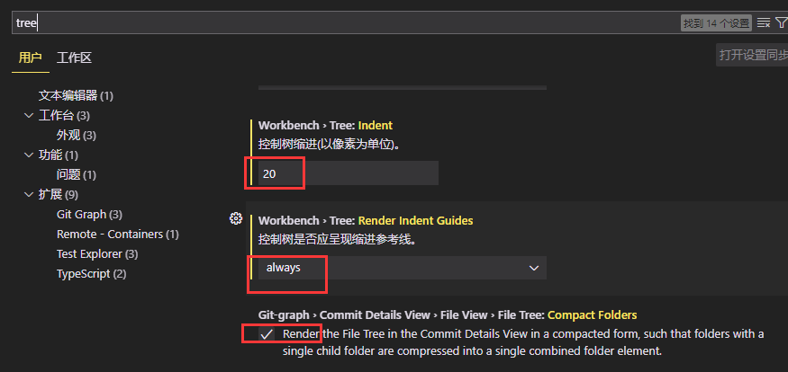


找到workbench.tree.indent，这个值就是缩进的像素数量，值越大，缩进越明显。

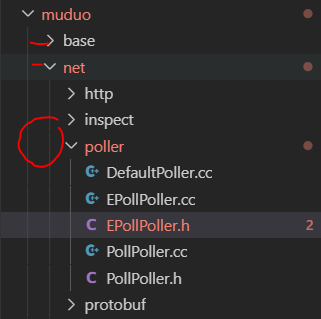

也可以把workbench.tree.renderIndentGuides选成always，这样会一直显示对齐的竖线。


 最终配置值都会显示在settings.json文件中，也可以到该文件输入代码：

```json
{
    // 资源管理器的树形目录层级距离、控制树缩进(以像素为单位)。
    "workbench.tree.indent": 20,
    // 资源管理器 控制树是否应呈现缩进参考线。
    "workbench.tree.renderIndentGuides": "always",
    // 缩进参考线的颜色
    "workbench.colorCustomizations": {
        "tree.indentGuidesStroke": "#008070"
    },
}
```


## VScode代码提示缓慢问题的解决办法

[VScode代码提示缓慢问题的解决办法](https://blog.csdn.net/qq_36689634/article/details/115187287)


上边那个是代码情况的提示，太短容易干扰阅读代码。

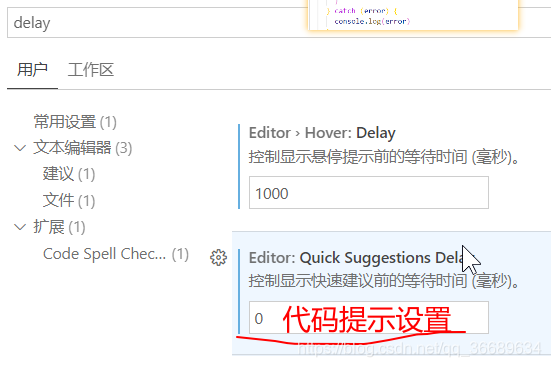

底下那个才是代码提示的设置，为0就行快了。


## vscode go 提示很慢

[vscode go 提示很慢](https://www.cnblogs.com/chongyao/p/13968356.html)

打开设置选项搜索  **go.useLanguageServe**


关于go vscode的一些设置的问题。 

代码能build 成功但是一直有错误提示（在设置中如下设置之后 然后在gopath 打开项目）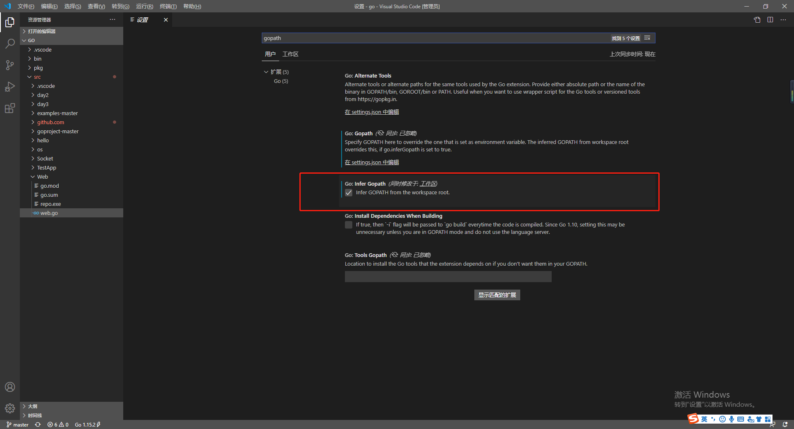

 

## 保存自动格式化

[Vscode如何设置代码保存后自动格式化](https://blog.csdn.net/asacmxjc/article/details/125474692)

[Vscode实现保存后自动格式化代码](https://blog.csdn.net/weixin_51735258/article/details/124071593)


### 方法一

1. 打开vscode，点击`设置`

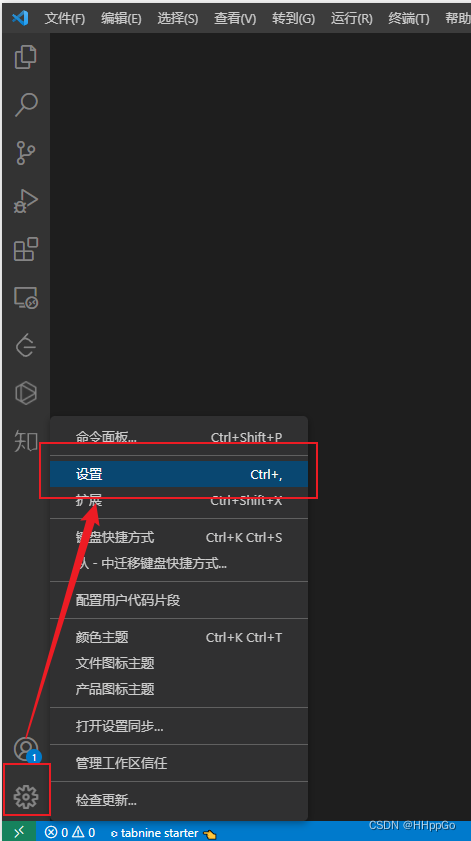

2. `搜索框`输入`格式化`，如图勾选这三个选项

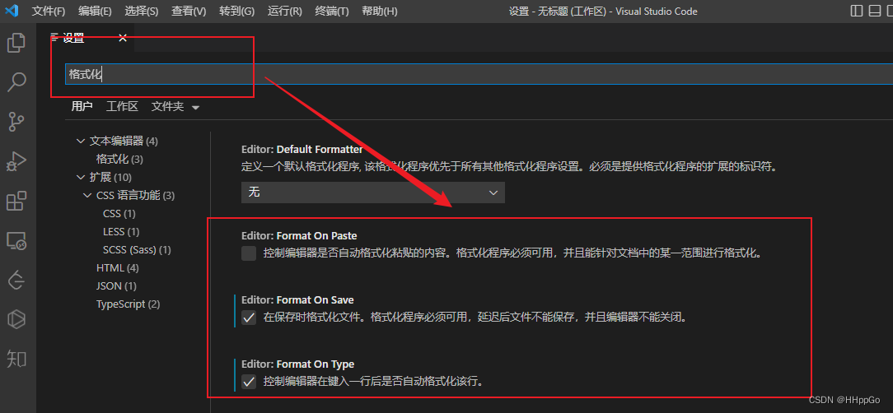

### 方法二

1. 打开设置，搜索框不要输入东西，点击如图标识

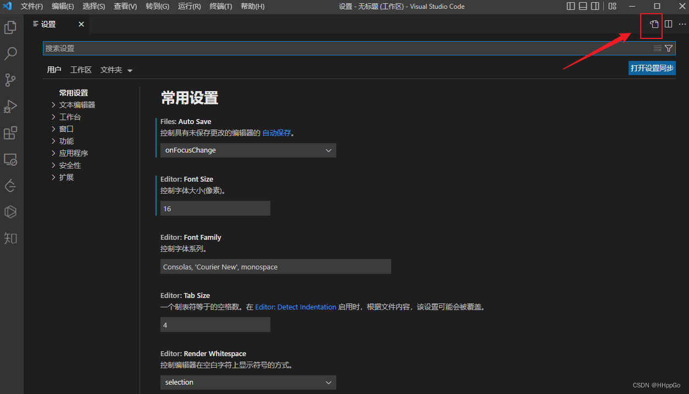

2. 点击后，会打开setting设置，输入如下的代码即可

```cpp
"editor.formatOnType": true,
"editor.formatOnSave": true,
"editor.formatOnPaste": true
```

```json
{
    // 失去焦点自动保存
    "files.autoSave": "onFocusChange",
    // 输入一行代码后自动格式化该行
    "editor.formatOnType": true,
    // 粘贴时，是否格式化粘贴的内容
    "editor.formatOnPaste": false,
    // 保存的时候格式化
    "editor.formatOnSave": true,
    "[go]": {
        "editor.insertSpaces": true,
        "editor.snippetSuggestions": "none",
        "editor.codeActionsOnSave": {
            "source.organizeImports": true
        }
    }
}
```


